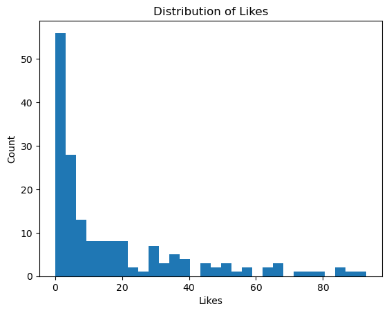
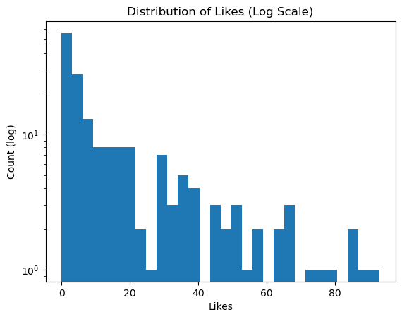
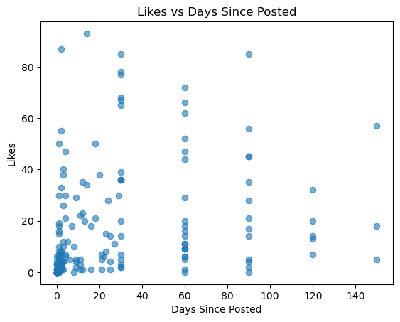
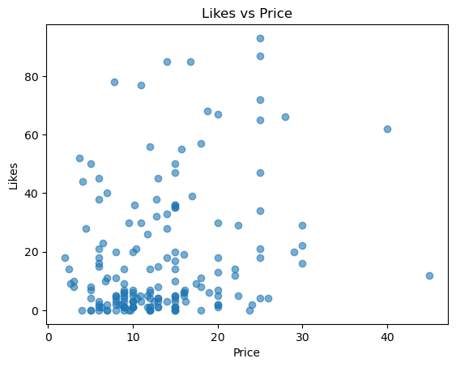
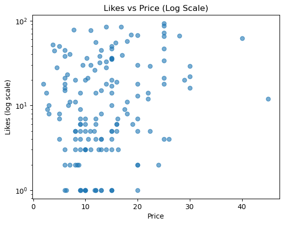
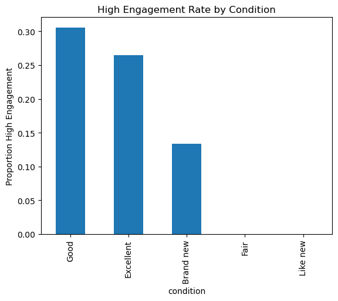

# Depop Listing Engagement Analysis

## Objective
Identify which listing attributes relate to engagement (likes) for vintage women’s tee listings on Depop.

## Dataset
`data/depop_vintage_womens_tees.csv`  
Columns: price, condition, brand, category, days_since_posted, likes

## Summary of Findings
- Engagement is highly right-skewed: most listings receive few likes.
- Likes accumulate over time with diminishing returns.
- Lower-priced items tend to receive higher engagement.
- Better condition is associated with higher likelihood of strong engagement.


```python
import numpy as np
import pandas as pd

print(np.__version__)
print(pd.__version__)

```


```python
import pandas as pd

df = pd.read_csv("../data/depop_vintage_womens_tees.csv")
df.head()

```


```python
import os
os.getcwd()

```


```python
df = pd.read_csv("data/depop_vintage_womens_tees.csv")
df.head()

```


```python
import pandas as pd

df = pd.read_csv("data/depop_vintage_womens_tees.csv")
df.head()
```


```python
import os

os.listdir()

```


```python
import os
os.listdir("data")

```


```python
df = pd.read_csv("data/depop_vintage_womens_tees.csv")
df.head()

```


```python
df["condition"] = df["condition"].str.lower()
df["brand"] = df["brand"].str.lower()

```


```python
df.head()

```


```python
df.info()

```


```python
df.describe()

```

## Data Loading & Validation
(Several path checks were used during setup to ensure consistent loading across environments.)


```python
import seaborn as sns
import matplotlib.pyplot as plt

sns.scatterplot(data=df, x="price", y="likes")
plt.title("Likes vs Price")
plt.show()

```

Engagement generally decreases as price increases, though some higher-priced listings still receive strong engagement, suggesting brand and condition influence visibility beyond price alone.


```python
sns.boxplot(data=df, x="condition", y="likes")
plt.title("Likes by Condition")
plt.show()

```

Listings in better condition categories tend to receive higher engagement, though overlap exists across conditions.


```python
top_brands = df["brand"].value_counts().head(10).index

sns.boxplot(
    data=df[df["brand"].isin(top_brands)],
    x="brand",
    y="likes"
)
plt.xticks(rotation=45)
plt.title("Likes by Brand (Top 10)")
plt.show()

```

Certain brands consistently outperform others in engagement, even at similar price points.


```python
median_likes = df["likes"].median()
df["high_engagement"] = (df["likes"] >= median_likes).astype(int)

df["high_engagement"].value_counts()

```

Listings were labeled as high or low engagement based on the median number of likes, enabling future classification modeling.


```python
import numpy as np

# 1) Standardize to string, strip spaces
df["likes_raw"] = df["likes"]  # keep original for transparency
df["likes"] = df["likes"].astype(str).str.strip()

# 2) Convert "99+" -> 99 (cap)
df["likes"] = df["likes"].str.replace("+", "", regex=False)

# 3) Convert to numeric; invalid -> NaN
df["likes"] = pd.to_numeric(df["likes"], errors="coerce")

# 4) Decide how to handle missing likes (recommended: fill with 0)
df["likes"] = df["likes"].fillna(0).astype(int)

df[["likes_raw", "likes"]].head(15)

```


```python
median_likes = df["likes"].median()
df["high_engagement"] = (df["likes"] >= median_likes).astype(int)

median_likes, df["high_engagement"].value_counts()

```


```python
(df["likes_raw"].astype(str).str.contains("99", na=False)).sum()

```


```python
df["likes"].describe()

```


```python
df["days_since_posted"] = pd.to_numeric(df["days_since_posted"], errors="coerce").fillna(df["days_since_posted"].median())
df["price"] = pd.to_numeric(df["price"], errors="coerce")

```


```python
from sklearn.model_selection import train_test_split
from sklearn.preprocessing import OneHotEncoder
from sklearn.compose import ColumnTransformer
from sklearn.pipeline import Pipeline
from sklearn.metrics import mean_absolute_error, accuracy_score
from sklearn.linear_model import LinearRegression, LogisticRegression

X = df[["price", "condition", "brand", "days_since_posted"]]
y_reg = df["likes"]
y_clf = df["high_engagement"]

categorical = ["condition", "brand"]
numeric = ["price", "days_since_posted"]

preprocessor = ColumnTransformer(
    transformers=[
        ("cat", OneHotEncoder(handle_unknown="ignore"), categorical),
        ("num", "passthrough", numeric),
    ]
)

```


```python
df.shape

```

## Modeling
Regression to predict likes and classification to predict high vs low engagement.


```python
# Regression: predict likes
from sklearn.model_selection import train_test_split
from sklearn.preprocessing import OneHotEncoder
from sklearn.compose import ColumnTransformer
from sklearn.pipeline import Pipeline
from sklearn.metrics import mean_absolute_error
from sklearn.linear_model import LinearRegression

X = df[["price", "condition", "brand", "days_since_posted"]]
y = df["likes"]

categorical = ["condition", "brand"]
numeric = ["price", "days_since_posted"]

preprocessor = ColumnTransformer(
    transformers=[
        ("cat", OneHotEncoder(handle_unknown="ignore"), categorical),
        ("num", "passthrough", numeric),
    ]
)

X_train, X_test, y_train, y_test = train_test_split(
    X, y, test_size=0.2, random_state=42
)

reg_model = Pipeline(
    steps=[
        ("prep", preprocessor),
        ("model", LinearRegression()),
    ]
)

reg_model.fit(X_train, y_train)
preds = reg_model.predict(X_test)

mae = mean_absolute_error(y_test, preds)
mae

```


```python
X = df[["price", "condition", "brand", "days_since_posted"]]
X.isna().sum()

```


```python
from sklearn.impute import SimpleImputer
from sklearn.preprocessing import OneHotEncoder
from sklearn.compose import ColumnTransformer
from sklearn.pipeline import Pipeline

categorical = ["condition", "brand"]
numeric = ["price", "days_since_posted"]

numeric_transformer = Pipeline(
    steps=[
        ("imputer", SimpleImputer(strategy="median"))
    ]
)

categorical_transformer = Pipeline(
    steps=[
        ("imputer", SimpleImputer(strategy="most_frequent")),
        ("onehot", OneHotEncoder(handle_unknown="ignore"))
    ]
)

preprocessor = ColumnTransformer(
    transformers=[
        ("cat", categorical_transformer, categorical),
        ("num", numeric_transformer, numeric),
    ]
)

```


```python
from sklearn.model_selection import train_test_split
from sklearn.metrics import mean_absolute_error
from sklearn.linear_model import LinearRegression

X = df[["price", "condition", "brand", "days_since_posted"]]
y = df["likes"]

X_train, X_test, y_train, y_test = train_test_split(
    X, y, test_size=0.2, random_state=42
)

reg_model = Pipeline(
    steps=[
        ("prep", preprocessor),
        ("model", LinearRegression()),
    ]
)

reg_model.fit(X_train, y_train)
preds = reg_model.predict(X_test)
mae = mean_absolute_error(y_test, preds)
mae

```


```python
X = df[["price", "condition", "brand", "days_since_posted"]]
y_reg = df["likes"]

print("X NaNs:\n", X.isna().sum(), "\n")
print("y_reg NaNs:", y_reg.isna().sum())

```


```python
# Drop rows that are completely blank
df = df.dropna(how="all")

# Drop rows missing essential columns
df = df.dropna(subset=["price", "condition", "brand", "days_since_posted", "likes"])

df.shape

```


```python
X = df[["price", "condition", "brand", "days_since_posted"]]
y_reg = df["likes"]

print("X NaNs:\n", X.isna().sum(), "\n")
print("y_reg NaNs:", y_reg.isna().sum())

```


```python
median_likes = df["likes"].median()
df["high_engagement"] = (df["likes"] >= median_likes).astype(int)

median_likes, df["high_engagement"].value_counts()

```


```python
import pandas as pd
import numpy as np

# 1) remove completely blank rows (safe)
df = df.dropna(how="all")

# 2) standardize likes -> numeric
df["likes"] = df["likes"].astype(str).str.strip()
df["likes"] = df["likes"].str.replace("+", "", regex=False)   # "99+" -> "99"
df["likes"] = pd.to_numeric(df["likes"], errors="coerce")     # strings -> numbers
df = df.dropna(subset=["likes"])                               # drop any weird leftovers
df["likes"] = df["likes"].astype(int)

# 3) (optional but recommended) ensure numeric fields are numeric
df["price"] = pd.to_numeric(df["price"], errors="coerce")
df["days_since_posted"] = pd.to_numeric(df["days_since_posted"], errors="coerce")

# 4) drop rows missing essentials for modeling
df = df.dropna(subset=["price", "condition", "brand", "days_since_posted"])

df[["likes", "price", "days_since_posted"]].dtypes, df.shape

```


```python
median_likes = df["likes"].median()
df["high_engagement"] = (df["likes"] >= median_likes).astype(int)

median_likes, df["high_engagement"].value_counts()

```


```python
from sklearn.model_selection import train_test_split
from sklearn.metrics import mean_absolute_error
from sklearn.linear_model import LinearRegression
from sklearn.pipeline import Pipeline

X = df[["price", "condition", "brand", "days_since_posted"]]
y = df["likes"]

X_train, X_test, y_train, y_test = train_test_split(
    X, y, test_size=0.2, random_state=42
)

reg_model = Pipeline(
    steps=[
        ("prep", preprocessor),
        ("model", LinearRegression()),
    ]
)

reg_model.fit(X_train, y_train)
preds = reg_model.predict(X_test)

mae = mean_absolute_error(y_test, preds)
mae

```

### Regression Results
The regression model predicts listing engagement (likes) with a mean absolute
error of approximately 23 likes. Given the long-tailed and noisy nature of
marketplace engagement data, this provides a reasonable baseline rather than
precise prediction.


```python
from sklearn.linear_model import LogisticRegression
from sklearn.metrics import accuracy_score

y = df["high_engagement"]

X_train, X_test, y_train, y_test = train_test_split(
    X, y, test_size=0.2, random_state=42
)

clf_model = Pipeline(
    steps=[
        ("prep", preprocessor),
        ("model", LogisticRegression(max_iter=1000)),
    ]
)

clf_model.fit(X_train, y_train)
preds = clf_model.predict(X_test)

acc = accuracy_score(y_test, preds)
baseline = y_test.mean()

acc, baseline

```

### Classification Results
The classifier outperformed a naive baseline, indicating that pricing and
listing metadata (price, brand, condition, and time since posting) contain
meaningful signal for predicting engagement.


```python
import pandas as pd

feature_names = clf_model.named_steps["prep"].get_feature_names_out()
coefs = clf_model.named_steps["model"].coef_[0]

importance = (
    pd.DataFrame({"feature": feature_names, "coef": coefs})
      .sort_values("coef", ascending=False)
)

importance.head(10)

```

### Feature Importance Insights
Brand recognition and item condition were the strongest predictors of
engagement. Listings associated with recognizable brands showed a higher
likelihood of strong engagement, while higher prices generally reduced
engagement probability.


```python
import pandas as pd
df = pd.read_csv("../data/depop_vintage_womens_tees.csv")
df.head()

```


<div>
<style scoped>
    .dataframe tbody tr th:only-of-type {
        vertical-align: middle;
    }

    .dataframe tbody tr th {
        vertical-align: top;
    }

    .dataframe thead th {
        text-align: right;
    }
</style>
<table border="1" class="dataframe">
  <thead>
    <tr style="text-align: right;">
      <th></th>
      <th>listing_title</th>
      <th>price</th>
      <th>category</th>
      <th>brand</th>
      <th>condition</th>
      <th>likes</th>
      <th>days_since_posted</th>
    </tr>
  </thead>
  <tbody>
    <tr>
      <th>0</th>
      <td>The Mountain Women's White and Blue T-shirt</td>
      <td>11.0</td>
      <td>vintage_womens_tee</td>
      <td>The Mountain</td>
      <td>Excellent</td>
      <td>30</td>
      <td>1.0</td>
    </tr>
    <tr>
      <th>1</th>
      <td>Urban Outfitters Women's Green T-shirt</td>
      <td>6.0</td>
      <td>vintage_womens_tee</td>
      <td>Urban Outfitters</td>
      <td>Excellent</td>
      <td>3</td>
      <td>2.0</td>
    </tr>
    <tr>
      <th>2</th>
      <td>American Vintage Women's Cream and Pink T-shirt</td>
      <td>15.0</td>
      <td>vintage_womens_tee</td>
      <td>Unknown</td>
      <td>Good</td>
      <td>10</td>
      <td>1.0</td>
    </tr>
    <tr>
      <th>3</th>
      <td>Nike Women's Grey T-shirt</td>
      <td>25.0</td>
      <td>vintage_womens_tee</td>
      <td>Nike</td>
      <td>Good</td>
      <td>21</td>
      <td>4.0</td>
    </tr>
    <tr>
      <th>4</th>
      <td>American Vintage Women's Yellow and Red T-shirt</td>
      <td>16.0</td>
      <td>vintage_womens_tee</td>
      <td>Unknown</td>
      <td>Excellent</td>
      <td>19</td>
      <td>1.0</td>
    </tr>
  </tbody>
</table>
</div>


```python
import pandas as pd
import numpy as np

df = pd.read_csv("../data/depop_vintage_womens_tees.csv")

print("rows, cols:", df.shape)
df.head(10)

```

    rows, cols: (199, 7)


<div>
<style scoped>
    .dataframe tbody tr th:only-of-type {
        vertical-align: middle;
    }

    .dataframe tbody tr th {
        vertical-align: top;
    }

    .dataframe thead th {
        text-align: right;
    }
</style>
<table border="1" class="dataframe">
  <thead>
    <tr style="text-align: right;">
      <th></th>
      <th>listing_title</th>
      <th>price</th>
      <th>category</th>
      <th>brand</th>
      <th>condition</th>
      <th>likes</th>
      <th>days_since_posted</th>
    </tr>
  </thead>
  <tbody>
    <tr>
      <th>0</th>
      <td>The Mountain Women's White and Blue T-shirt</td>
      <td>11.00</td>
      <td>vintage_womens_tee</td>
      <td>The Mountain</td>
      <td>Excellent</td>
      <td>30</td>
      <td>1.0</td>
    </tr>
    <tr>
      <th>1</th>
      <td>Urban Outfitters Women's Green T-shirt</td>
      <td>6.00</td>
      <td>vintage_womens_tee</td>
      <td>Urban Outfitters</td>
      <td>Excellent</td>
      <td>3</td>
      <td>2.0</td>
    </tr>
    <tr>
      <th>2</th>
      <td>American Vintage Women's Cream and Pink T-shirt</td>
      <td>15.00</td>
      <td>vintage_womens_tee</td>
      <td>Unknown</td>
      <td>Good</td>
      <td>10</td>
      <td>1.0</td>
    </tr>
    <tr>
      <th>3</th>
      <td>Nike Women's Grey T-shirt</td>
      <td>25.00</td>
      <td>vintage_womens_tee</td>
      <td>Nike</td>
      <td>Good</td>
      <td>21</td>
      <td>4.0</td>
    </tr>
    <tr>
      <th>4</th>
      <td>American Vintage Women's Yellow and Red T-shirt</td>
      <td>16.00</td>
      <td>vintage_womens_tee</td>
      <td>Unknown</td>
      <td>Excellent</td>
      <td>19</td>
      <td>1.0</td>
    </tr>
    <tr>
      <th>5</th>
      <td>L.L.Bean Women's multi T-shirt</td>
      <td>15.00</td>
      <td>vintage_womens_tee</td>
      <td>L. L. Bean</td>
      <td>Excellent</td>
      <td>47</td>
      <td>4.0</td>
    </tr>
    <tr>
      <th>6</th>
      <td>Nike Women's Red T-shirt</td>
      <td>12.00</td>
      <td>vintage_womens_tee</td>
      <td>Nike</td>
      <td>Excellent</td>
      <td>4</td>
      <td>3.0</td>
    </tr>
    <tr>
      <th>7</th>
      <td>Brandy Melville Women's Pink T-shirt</td>
      <td>15.75</td>
      <td>vintage_womens_tee</td>
      <td>Brandy Melville</td>
      <td>Good</td>
      <td>55</td>
      <td>2.0</td>
    </tr>
    <tr>
      <th>8</th>
      <td>Women's Red T-shirt</td>
      <td>6.00</td>
      <td>vintage_womens_tee</td>
      <td>Unknown</td>
      <td>Good</td>
      <td>15</td>
      <td>1.0</td>
    </tr>
    <tr>
      <th>9</th>
      <td>Victoria's Secret Women's Blue and Navy Shirt</td>
      <td>11.75</td>
      <td>vintage_womens_tee</td>
      <td>Victoria's Secret</td>
      <td>Excellent</td>
      <td>26</td>
      <td>3.0</td>
    </tr>
  </tbody>
</table>
</div>


```python
summary = pd.DataFrame({
    "dtype": df.dtypes.astype(str),
    "missing": df.isna().sum(),
    "missing_pct": (df.isna().mean() * 100).round(2),
    "n_unique": df.nunique(dropna=True)
}).sort_values("missing_pct", ascending=False)

summary.head(25)

```


<div>
<style scoped>
    .dataframe tbody tr th:only-of-type {
        vertical-align: middle;
    }

    .dataframe tbody tr th {
        vertical-align: top;
    }

    .dataframe thead th {
        text-align: right;
    }
</style>
<table border="1" class="dataframe">
  <thead>
    <tr style="text-align: right;">
      <th></th>
      <th>dtype</th>
      <th>missing</th>
      <th>missing_pct</th>
      <th>n_unique</th>
    </tr>
  </thead>
  <tbody>
    <tr>
      <th>listing_title</th>
      <td>object</td>
      <td>10</td>
      <td>5.03</td>
      <td>163</td>
    </tr>
    <tr>
      <th>price</th>
      <td>float64</td>
      <td>10</td>
      <td>5.03</td>
      <td>68</td>
    </tr>
    <tr>
      <th>brand</th>
      <td>object</td>
      <td>10</td>
      <td>5.03</td>
      <td>69</td>
    </tr>
    <tr>
      <th>likes</th>
      <td>object</td>
      <td>10</td>
      <td>5.03</td>
      <td>56</td>
    </tr>
    <tr>
      <th>condition</th>
      <td>object</td>
      <td>10</td>
      <td>5.03</td>
      <td>5</td>
    </tr>
    <tr>
      <th>days_since_posted</th>
      <td>float64</td>
      <td>10</td>
      <td>5.03</td>
      <td>31</td>
    </tr>
    <tr>
      <th>category</th>
      <td>object</td>
      <td>0</td>
      <td>0.00</td>
      <td>1</td>
    </tr>
  </tbody>
</table>
</div>


```python
# show likely engagement-related columns (likes, saves, comments, etc.)
candidates = [c for c in df.columns if any(k in c.lower() for k in ["like", "save", "comment", "engage", "view", "click"])]
candidates

```


    ['likes']


```python
df.shape

```


    (199, 7)


## Next
- Identify the best engagement metric (likes / saves / comments).
- Clean numeric columns (price, likes) and handle outliers.
- Explore relationships: price vs engagement, keywords/brand vs engagement.


```python
df["likes"].describe()

```


    count     189
    unique     56
    top         1
    freq       18
    Name: likes, dtype: object


```python
df["likes"].isna().sum(), (df["likes"] < 0).sum()

```


    ---------------------------------------------------------------------------

    TypeError                                 Traceback (most recent call last)

    Cell In[7], line 1
    ----> 1 df["likes"].isna().sum(), (df["likes"] < 0).sum()


    File ~/anaconda3/envs/depop/lib/python3.11/site-packages/pandas/core/ops/common.py:76, in _unpack_zerodim_and_defer.<locals>.new_method(self, other)
         72             return NotImplemented
         74 other = item_from_zerodim(other)
    ---> 76 return method(self, other)


    File ~/anaconda3/envs/depop/lib/python3.11/site-packages/pandas/core/arraylike.py:48, in OpsMixin.__lt__(self, other)
         46 @unpack_zerodim_and_defer("__lt__")
         47 def __lt__(self, other):
    ---> 48     return self._cmp_method(other, operator.lt)


    File ~/anaconda3/envs/depop/lib/python3.11/site-packages/pandas/core/series.py:6138, in Series._cmp_method(self, other, op)
       6135 lvalues = self._values
       6136 rvalues = extract_array(other, extract_numpy=True, extract_range=True)
    -> 6138 res_values = ops.comparison_op(lvalues, rvalues, op)
       6140 return self._construct_result(res_values, name=res_name)


    File ~/anaconda3/envs/depop/lib/python3.11/site-packages/pandas/core/ops/array_ops.py:344, in comparison_op(left, right, op)
        341     return invalid_comparison(lvalues, rvalues, op)
        343 elif lvalues.dtype == object or isinstance(rvalues, str):
    --> 344     res_values = comp_method_OBJECT_ARRAY(op, lvalues, rvalues)
        346 else:
        347     res_values = _na_arithmetic_op(lvalues, rvalues, op, is_cmp=True)


    File ~/anaconda3/envs/depop/lib/python3.11/site-packages/pandas/core/ops/array_ops.py:129, in comp_method_OBJECT_ARRAY(op, x, y)
        127     result = libops.vec_compare(x.ravel(), y.ravel(), op)
        128 else:
    --> 129     result = libops.scalar_compare(x.ravel(), y, op)
        130 return result.reshape(x.shape)


    File pandas/_libs/ops.pyx:107, in pandas._libs.ops.scalar_compare()


    TypeError: '<' not supported between instances of 'str' and 'int'


```python
df["likes"].dtype

```


    dtype('O')


```python
df["likes"].unique()[:20]

```


    array(['30', '3', '10', '21', '19', '47', '4', '55', '15', '26', '20',
           '7', '99+', '0', '6', '23', '5', '1', '18', '13'], dtype=object)


```python
df["likes"] = (
    df["likes"]
    .astype(str)          # ensure everything is string
    .str.strip()          # remove whitespace
    .replace({"": None, "—": None, "None": None})
)

df["likes"] = pd.to_numeric(df["likes"], errors="coerce")

```


```python
df["likes"].dtype

```


    dtype('float64')


```python
df["likes"].isna().sum(), (df["likes"] < 0).sum()

```


    (np.int64(25), np.int64(0))


```python
df["likes"].describe()

```


    count    174.000000
    mean      17.063218
    std       21.424461
    min        0.000000
    25%        2.250000
    50%        7.000000
    75%       22.750000
    max       93.000000
    Name: likes, dtype: float64


## Likes Column Cleaning
The `likes` field was originally stored as text.
Values were stripped, invalid entries coerced to missing, and converted to numeric
to support quantitative analysis.


```python
high_engagement_threshold = df["likes"].quantile(0.75)
high_engagement_threshold

```


    np.float64(22.75)


## Engagement Definition
Listings with likes in the top 25% (≥ ~23 likes) are classified as **high engagement**.
This threshold balances sample size with meaningful interest.


```python
import matplotlib.pyplot as plt

plt.figure()
plt.hist(df["likes"], bins=30)
plt.title("Distribution of Likes")
plt.xlabel("Likes")
plt.ylabel("Count")
plt.show()

plt.figure()
plt.hist(df["likes"], bins=30)
plt.yscale("log")
plt.title("Distribution of Likes (Log Scale)")
plt.xlabel("Likes")
plt.ylabel("Count (log)")
plt.show()

```


    

    


    

    


```python
df.dtypes.sort_values()

```


    price                float64
    likes                float64
    days_since_posted    float64
    listing_title         object
    category              object
    brand                 object
    condition             object
    dtype: object


```python
plt.figure()
plt.scatter(df["days_since_posted"], df["likes"], alpha=0.6)
plt.xlabel("Days Since Posted")
plt.ylabel("Likes")
plt.title("Likes vs Days Since Posted")
plt.show()

```


    

    


```python
plt.figure()
plt.scatter(df["days_since_posted"], df["likes"], alpha=0.6)
plt.yscale("log")
plt.xlabel("Days Since Posted")
plt.ylabel("Likes (log scale)")
plt.title("Likes vs Days Since Posted (Log Scale)")
plt.show()

```


    

    


## Time Effect
Engagement increases with time on platform, but the relationship is nonlinear.
Most listings receive the majority of engagement early, with diminishing returns over time.


```python
plt.figure()
plt.scatter(df["price"], df["likes"], alpha=0.6)
plt.xlabel("Price")
plt.ylabel("Likes")
plt.title("Likes vs Price")
plt.show()

```


    

    


```python
plt.figure()
plt.scatter(df["price"], df["likes"], alpha=0.6)
plt.yscale("log")
plt.xlabel("Price")
plt.ylabel("Likes (log scale)")
plt.title("Likes vs Price (Log Scale)")
plt.show()

```


    

    


```python
high_engagement_threshold = df["likes"].quantile(0.75)

df["high_engagement"] = df["likes"] >= high_engagement_threshold

df["high_engagement"].value_counts()

```


    high_engagement
    False    155
    True      44
    Name: count, dtype: int64


## High Engagement Label
Listings are labeled as **high engagement** if their number of likes falls
in the top 25% of the dataset (≥ 75th percentile).


## Price Sensitivity
Lower-priced items tend to receive higher engagement.
High-priced listings show greater variance, suggesting niche or brand-driven interest.


```python
engagement_by_condition = (
    df.groupby("condition")["high_engagement"]
    .mean()
    .sort_values(ascending=False)
)

engagement_by_condition

```


    condition
    Good         0.305556
    Excellent    0.264957
    Brand new    0.133333
    Fair         0.000000
    Like new     0.000000
    Name: high_engagement, dtype: float64


```python
plt.figure()
engagement_by_condition.plot(kind="bar")
plt.ylabel("Proportion High Engagement")
plt.title("High Engagement Rate by Condition")
plt.show()

```


    

    


```python

```
